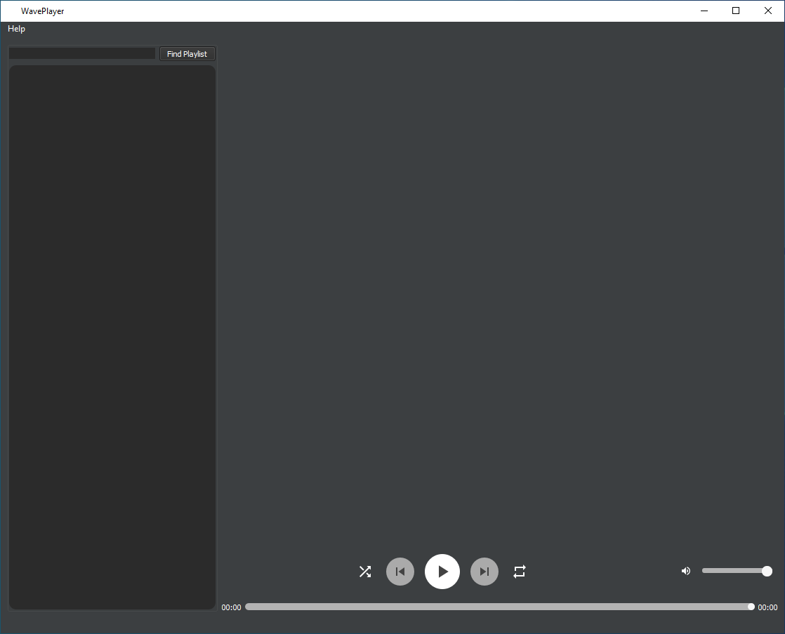
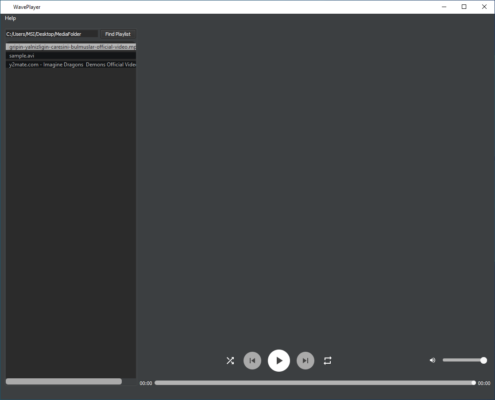
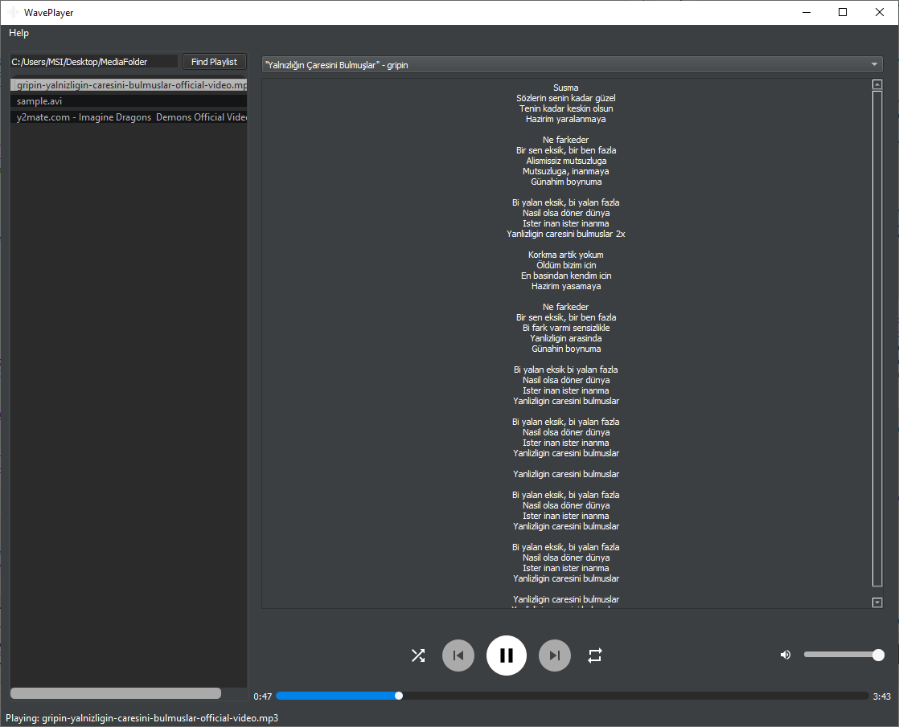
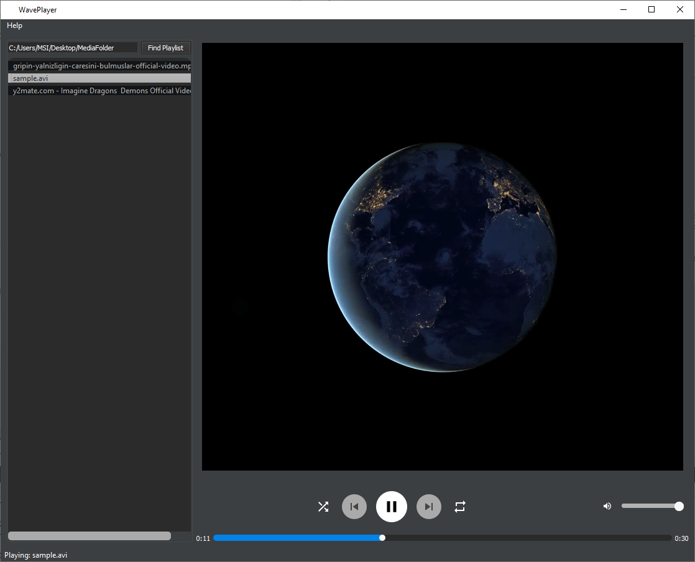
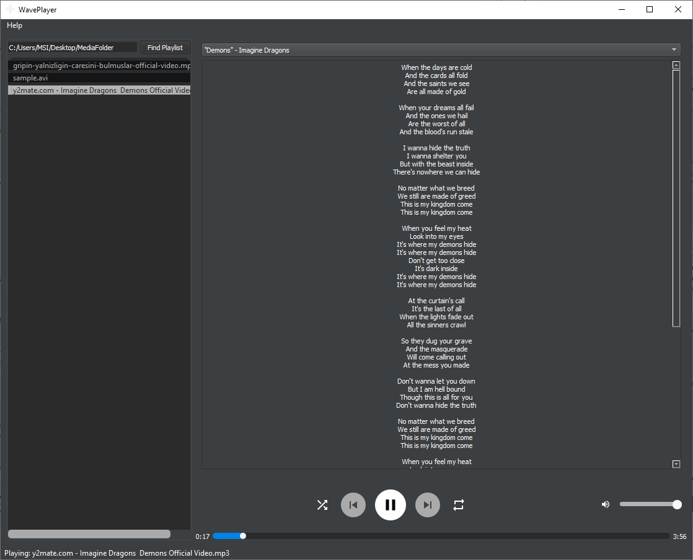

# WavePlayer
 
This project is about to create a desktop media player using Qt framework. It features to show the lyric of your music contents. It consists of a python script that requests the music lyrics from azlyrics.com.


## Preview
UI of the program is as follows:

 
 


## Dependencies
* MinGW32 8.1
* Qt 5.15.2
* K-Lite Codec Pack (necessary for playing content)
* Python 3.7 or above

In addition to above dependencies, following Python modules should be installed prior to build:
```
pip install requests bs4 requests_html
```

## Installation
```
git clone https://github.com/Viriliter/WavePlayer.git
```

## Known Issues
* azlyrics.com may block the ip address after some lyric search. Restarting the router is necessary if you are using dynamic IP.
* Web scraping is very costly operation so loading time of the lyrics is high. 
* Random media playing is not working.
